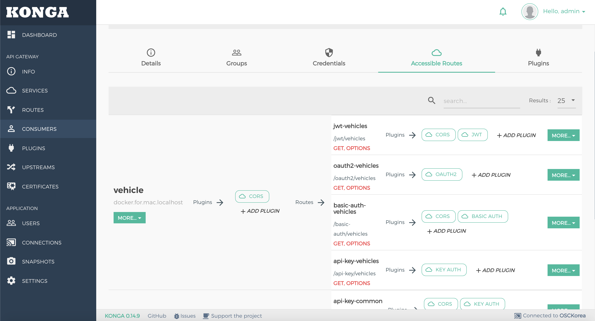

# Kong 인증

##1. 개요
- Kong 에서 제공하는 Basic-auth, APIKey, JWT, Oauth2 방식의 인증을 적용합니다.
- Service, Route 를 만들어 Vehicle API 와 Common API 를 각각 연결합니다.
- API 자원을 소비할 Consumer를 만듭니다.
- Local Test 화면에서 Vehicle-Fe 를 호출하고 Vehicle-Fe 에서 설정된 Kong 주소를 호출합니다.

##2. 설정방법
- k8s와 Docker 가 설치되어 있어야 합니다.
- 예제에서는 kind Cluster 를 사용하였습니다. (https://kind.sigs.k8s.io/)
- Vehicle API의 Kong / Kong2 Branch 를 사용하면됩니다. ( Kong = JWT, Kong2 = Oauth2 )
- Docker 로 Vehicle API, Common API 가 동작 하고 있어야합니다.
- 브랜치 변경후 각각 skaffold 를 통해 Dockerizing 과 k8s 환경으로 배포합니다.

```shell script
skaffold dev -p kind
```
- 포트포워딩을 통해 Cluster 외부에서 접근가능하도록 합니다.
```shell script
kubectl port-forward vehicle-api-5db5b5bb66-kj65h 9001:9001 -n vehicle
```

### Kong Database 설치
1. Service 만들기
    
    - Service Tab 에서 Route를 하나로 묶어줄 Service 를 생성합니다. ( Common, Vehicle )
2. Route 만들기
    
    - Service 에서 각 Route 를 생성합니다. 이주소는 Api Gateway의 End Point 가 됩니다.
    
    - /basic-auth/~ , /api-key/~ , /jwt/~ , /oauth2/~ 의 4종류의 인증을 테스트해볼 Route를 작성합니다.
    
3. Consumer 만들기
    
    - 각 API 를 사용할수있는 Consumer 를 만듭니다.
    - 생성된 Consumer의 Credential Tab으로 이동하여 인증정보를 작성합니다.
        1. Basic-auth
        
            - Credential Tab의 Basic 항목에서 생성합니다.
        2. Basic-auth
        
            - Credential Tab의 ApiKey 항목에서 생성합니다.
        3. Basic-auth
        
            - Credential Tab의 Oauth2 항목에서 생성합니다.
        4. Basic-auth
        
            - Credential Tab의 JWT 항목에서 생성합니다.
    - Accessible Routes 탭으로가면 허용된 Route 를 볼수있습니다.
    
4. Auth0 연동
    - JWT 와 Oauth2 의 인증을 쉽게 구현할수있는 Auth0와 연동합니다.
    
    
    - Application 생성후 Callback URL, Logout URL, WebOrigin URL 에 Local Test 용 주소를 작성합니다. (http://localhost:8011/)
    1. JWT
        1. Auth0 인증서 다운로드
            ```shell script
            curl -o {COMPANYNAME}.pem https://{COMPANYNAME}.{REGION-ID}.auth0.com/pem
            ```
        2. X509 인증서에서 공개키 추출
            ```shell script
            openssl x509 -pubkey -noout -in {COMPANYNAME}.pem > pubkey.pem
            ```
        3. 추출한 공개키를 rsa_public_key에 입력
        
    2. Oauth2
        1. Local Login 화면의 로그인 성공시 AccessToken을 KongDB로 토큰 Migration
            - vehicle-fe 프로젝트 kong2 branch 의 web/index.html 의 javascript 함수
                (credential.id 는 consumer oauth2 credential 의 id 입니다.)
            ```javascript
               async function migrationAccessToken() {
                   let headers = new Headers();
                   
           
                   let formData = new FormData();
                   formData.append('credential.id', '1fee97fe-cc8b-432f-997a-1bff24d5b3e5');
                   formData.append('token_type', 'bearer');
                   formData.append('access_token', accessToken);
                   formData.append('expires_in', 7200);
           
                   fetch('http://localhost:8001/oauth2_tokens', {
                       method: 'POST',
                       headers: headers,
                       body: formData
                   })
                       .then(function(res) {
                           console.log('kong migration end');
                           return res.json();
                       })
           
               }
            ```
        
        
        
    
            

##3. 결과화면
결과 화면은 Vehicle-fe branch 의  Web 폴더에 있으며 Auth0 의 JWT와 oauth2의 구분을 위해 kong/ kong2 branch 로 나눠서 생성하였습니다.
(Auth0 로 토큰 요청시 JWT 토큰을 요청 하거나 일반 AccessToken 을 요청하는 구분이 필요함)

- Basic Auth


- Api Key


- Oauth2 ( vehicle-fe / kong2 branch )


- JWT ( vehicle-fe / kong branch)


##4. 참조
- https://konghq.com/
- https://pantsel.github.io/konga/
- https://auth0.com/docs


