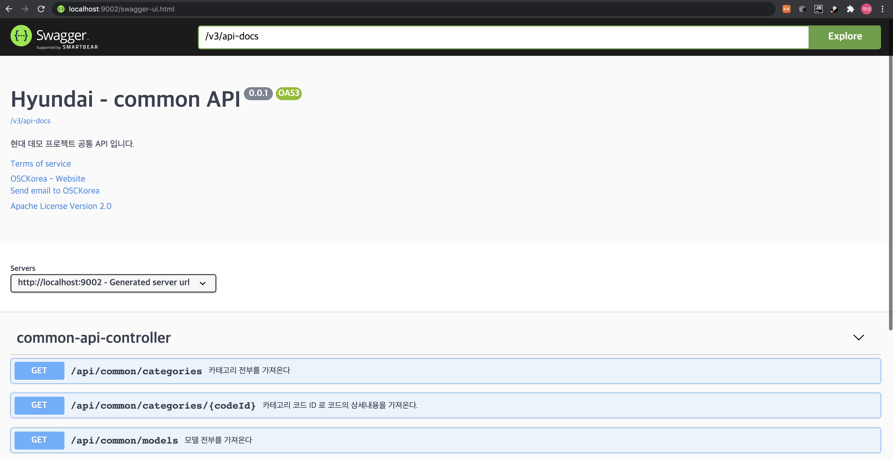

# Swagger 설정

##1. 개요
- API 작성시 API 정보를 코드에 같이 삽입하여 항상 최신의 API 정보를 나타낼 수 있으며 개발자는 Swagger의 UI 를 통해 API 를 파악할 수 있습니다.
 - UI 화면에서 바로 API Call Test 를 진행해볼수있습니다.
##2. 설정방법
maven, gradle 에 따라 dependency 를 추가합니다.

### maven ( pom.xml )
```xml
<dependency>
    <groupId>org.springdoc</groupId>
    <artifactId>springdoc-openapi-ui</artifactId>
    <version>1.4.1</version>
</dependency> 
  
```
dependency 를 추가하면
- http://로컬주소/v3/api-docs 에서 관련 JSON 스트링을 볼수있습니다.

- http://로컬주소/swagger-ui.html 에서 UI 화면을 볼수있습니다.
### resource
```yaml
springdoc:
  version: '0.0.1'
  api-docs:
    groups:
      enabled: true
  default-consumes-media-type: application/json
  default-produces-media-type: application/json
  swagger-ui:
    path: /swagger-ui.html
    displayRequestDuration: true
    groups-order: DESC
```
- application.yaml 파일에 Swagger 관련 기본 설정을 추가합니다.

### 프로젝트에서 Swagger 관련 Configuration 설정
```java
@Configuration
public class OpenApiConfig {


    @Bean
    public OpenAPI openAPI(@Value("${springdoc.version}") String appVersion) {
        Info info = new Info().title("Hyundai - common API").version(appVersion)
                .description("현대 데모 프로젝트 공통 API 입니다.")
                .termsOfService("http://swagger.io/terms/")
                .contact(new Contact().name("OSCKorea").url("https://osckorea.com/").email("stuie.lim@osckorea.com"))
                .license(new License().name("Apache License Version 2.0").url("http://www.apache.org/licenses/LICENSE-2.0"));

        return new OpenAPI()
                .components(new Components())
                .info(info);
    }

}
```

### API controller 에 API 설정부분 작성

```java

@Operation(summary = "카테고리 코드 ID 로 코드의 상세내용을 가져온다.")
@ApiResponses(value = {
        @ApiResponse(responseCode = "200", description = "코드를 가져옴",
                content = { @Content(mediaType = "application/json",
                        schema = @Schema(implementation = Code.class)) }) })
@GetMapping("/categories/{codeId}")
public Code  searchCategory(@Parameter(description = "카테고리 Code ID") @PathVariable String codeId){

    Code category = repository.findByCodeIdAndCodeType(codeId, CATEGORY_TYPE);
    return category;
}
```

- API 관련 설명을 작성합니다. @Operation, @ApiResponses 어노테이션 부분 

### Model 객체에 API 관련 설명을 작성한다.
```java
@Data
@Entity
@Table(name = "code")
public class Code  implements Serializable{

    /**
     *
     */
    private static final long serialVersionUID = 1L;


    @Id
    @GeneratedValue(strategy = GenerationType.IDENTITY)
    @Column(name = "code_seq")
    @Schema(description = "코드 순서")
    private int codeSeq;

    @Column(name = "code_id")
    @Schema(description = "코드 ID")
    private String codeId;

    @Column(name = "code_name")
    @Schema(description = "코드 명")
    private String codeName;

    @Column(name = "code_type")
    @Schema(description = "코드 타입")
    private String codeType;

    @Column(name = "code_type_name")
    @Schema(description = "코드 타입명")
    private String codeTypeName;


}

```

- @Schema 어노테이션

##3. 결과화면
위내용대로 설정하면 http://로컬주소/swagger-ui.html 로 접속할시 다음과 같은 화면을 볼수있습니다.



##4. 참조
- https://springdoc.org/springdoc-properties.html
- https://swagger.io/


